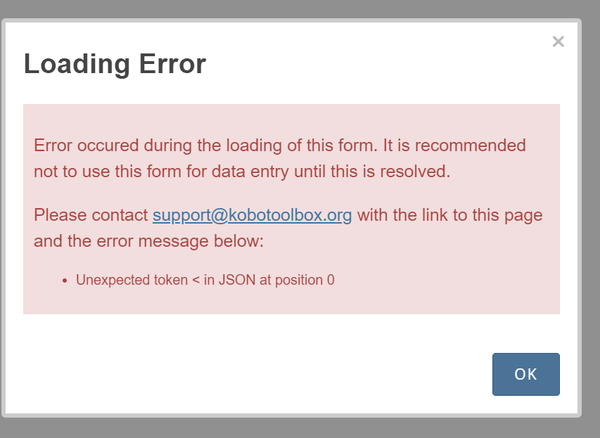
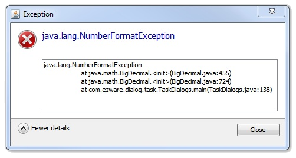
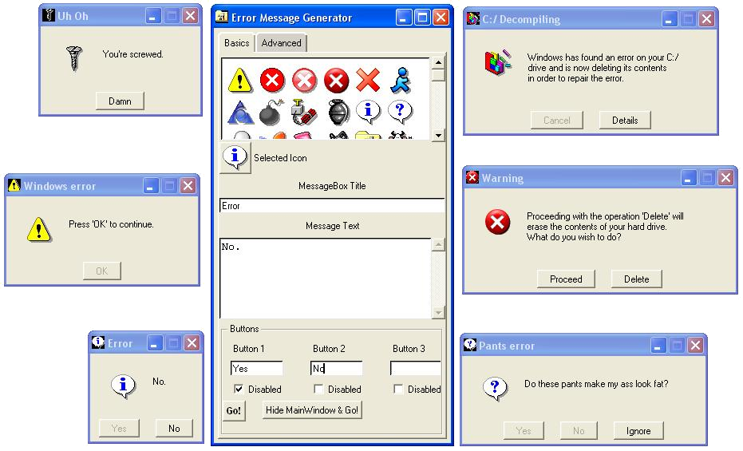
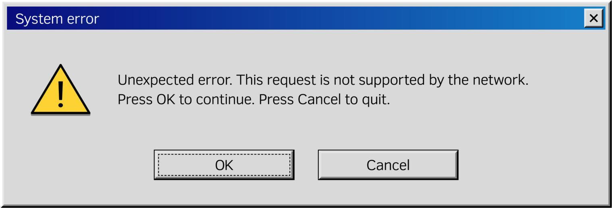

# Failing with Grace

> A collection of random links and material revolving around error messaging

A preparation for the workshop <a href="https://events.pinetool.ai/3498/#sessions/111169">Failing with Grace - A Call for Better Error Reporting</a> at <a href="testcon.lt">TestCon 25</a>.

<div align="center">
  
</div>

---

## Service Recovery Paradox

The <a href="https://en.wikipedia.org/wiki/Service_recovery_paradox">service recovery paradox</a> occurs when a customer ends up more satisfied after a well-handled service failure than if nothing had gone wrong


## Error Dialogs

<div align="center">
  
</div>


### Error message Best Practices


> Best practices for error message dialogs:

* https://v4-archive.patternfly.org/v4/design-guidelines/usage-and-behavior/modal
* https://mobbin.com/glossary/error-message

### Error Message Generation Prompt

```
Create a random error message that could appear in a log file. Create detailed information such as stack traces and previous warnings, along side possible irrelevant log entries.
```

<a href="aislop/error1.html">Generated error message</a>

## Log messages

### Collection of logs

* <a href="https://github.com/logpai/loghub">Loghub - Github project collecting logs</a>
* <a href="https://github.com/logpai/loghub-2.0">Loghub 2.0 - More logs on Github</a>
* <a href="https://www.kaggle.com/datasets/eliasdabbas/web-server-access-logs">Kaggle - Webserver Access Logs</a>
* <a href="https://www.kaggle.com/datasets/ggsri123/linux-logs">Kaggle - Linux Logs</a>

### Logging practices

* <a href="https://opensourcehacker.com/2016/05/22/python-standard-logging-pattern/">Python logging pattern</a>
* <a href="https://medium.com/@rahulkumar_33287/logger-error-versus-logger-exception-4113b39beb4b">Python way of logging exceptions</a>

### Real error reports

* https://community.sonarsource.com/t/error-a-stack-overflow-error-occurred-while-analyzing/32384/3
* https://stackoverflow.com/questions/12273124/strange-git-error
* https://discourse.psychopy.org/t/exit-code-1-error-when-syncing-no-changes-added-to-commit/8978

### AI prompt

```
Create an error log orginating for applicatin {APPLICATION} that failes while executing {FAILED ACTION}. Create detailed information such as stack traces and previous warnings, along with a lot of possibly irrelevant log entries.
```

## Error channels

Who is the the addressee of the error?

<div align="center">
  
</div>

<div align="center">
  
</div>


Possible consumers:
- **Users**: Service recovery paradox
- **Operations**: Health status
- **Devs**: Availability vs Privacy
- **Management**: Statistics and metrics
- **ChatBots**: What is the relevant context

## Annoying archetypes

### Generic errors

Error messages generated by the <a href="https://www.kirsle.net/errorgen-classic">Kirsle error message generator</a>

<div align="center">
  
</div>

### "Unexpected" errors

<div align="center">
  
</div>


<div align="center">
  
</div>

## Metrics

* <a href="https://dora.dev/guides/dora-metrics-four-keys/">DORA Key metrics</a>
* <a href="https://www.atlassian.com/incident-management/kpis/common-metrics">MTBF, MTTR, MTTA, and MTTF</a>

## Glossary

* **Bug**
* **Debt**
* **Defect**
* **Error**
* **Failure**
* **Fault**
* **Incident**
* **Issue**
* **Problem**
* **Risk**
* **Threat**
* **Warning**
